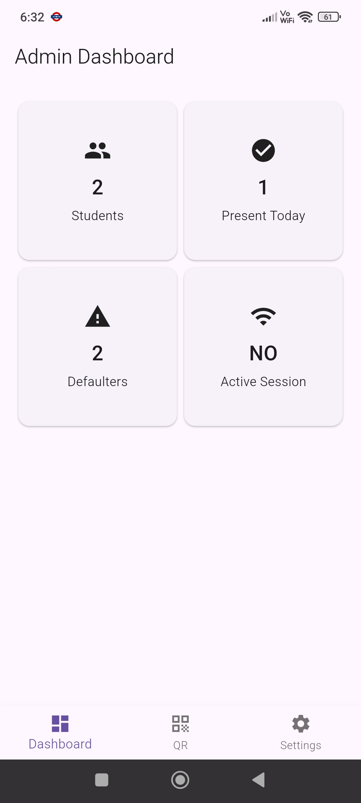
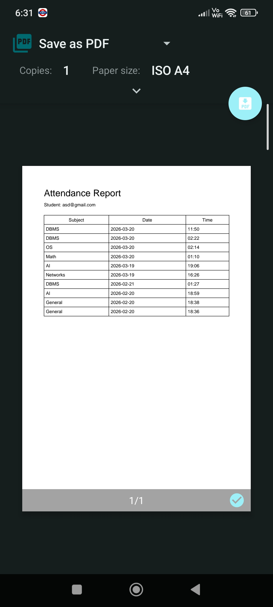
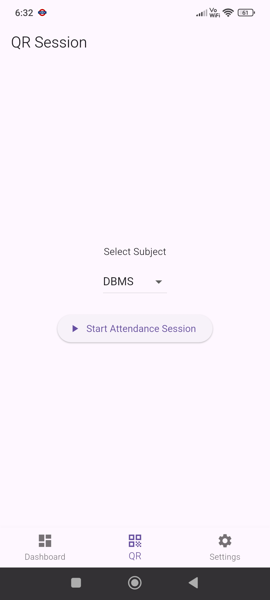
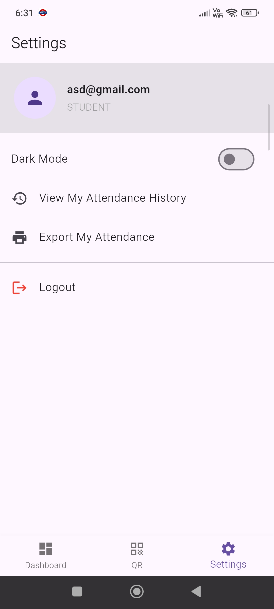
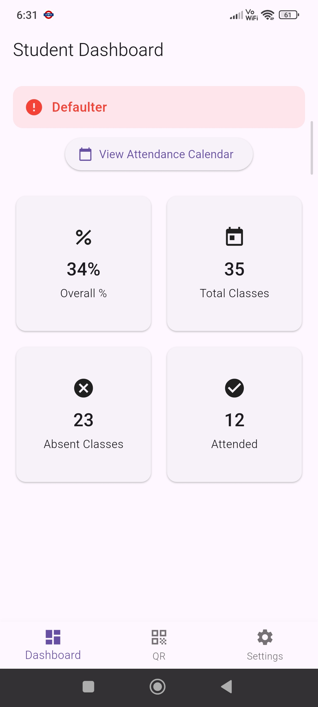
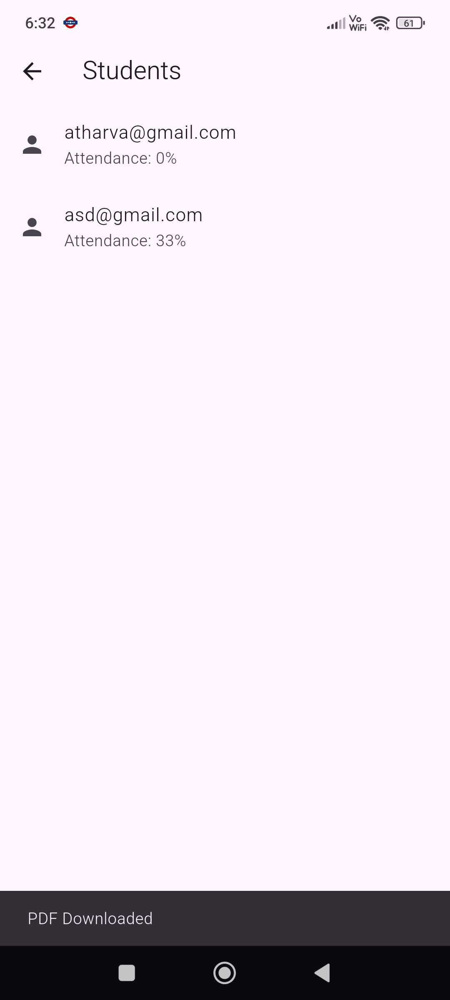
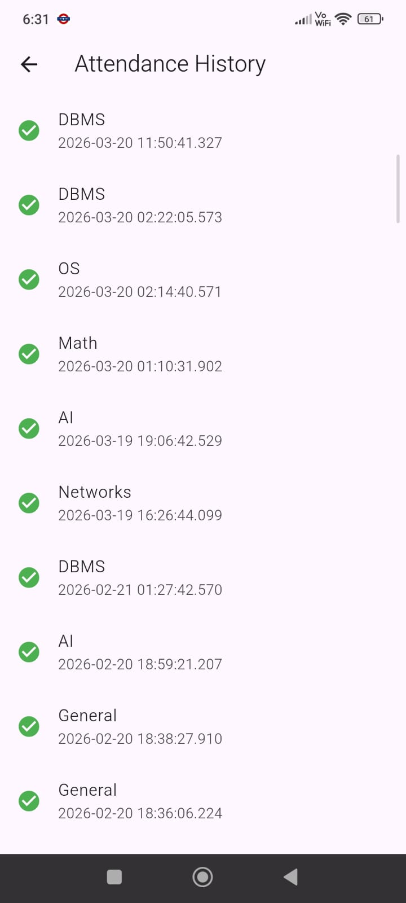
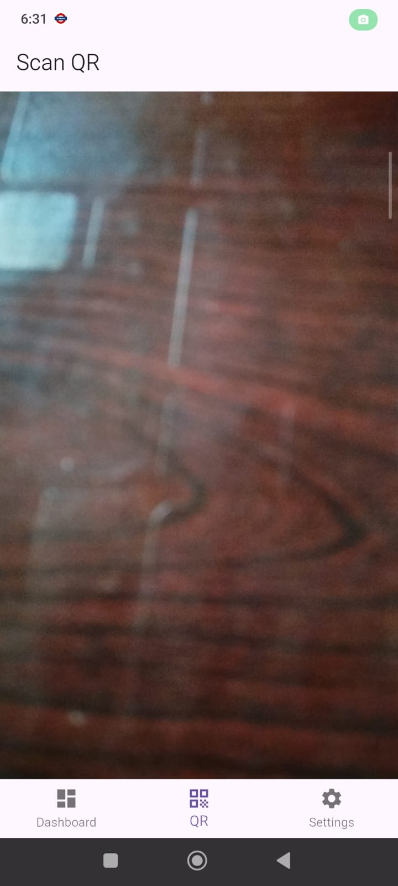

# Attendify App

A mobile-based Smart Attendance System developed using Flutter and Firebase for efficient attendance management.

## Features
- User Authentication
- Mark Attendance
- Attendance Tracking
- Attendance History
- QR Code Attendance System
- Generate QR Codes
- Scan QR Codes
- Firebase Integration
- Real-Time Data Storage
- Clean UI Design

## Tech Stack
- Flutter
- Dart
- Firebase
- Android Studio

## APK Download
[Download APK](https://drive.google.com/file/d/1BCT0NBu3EbJbhjITAp_7DR_fQseeTEtZ/view?usp=drivesdk)

## Author
Atharva Dhore

## Preview

### Admin Side

---

### Student Side

